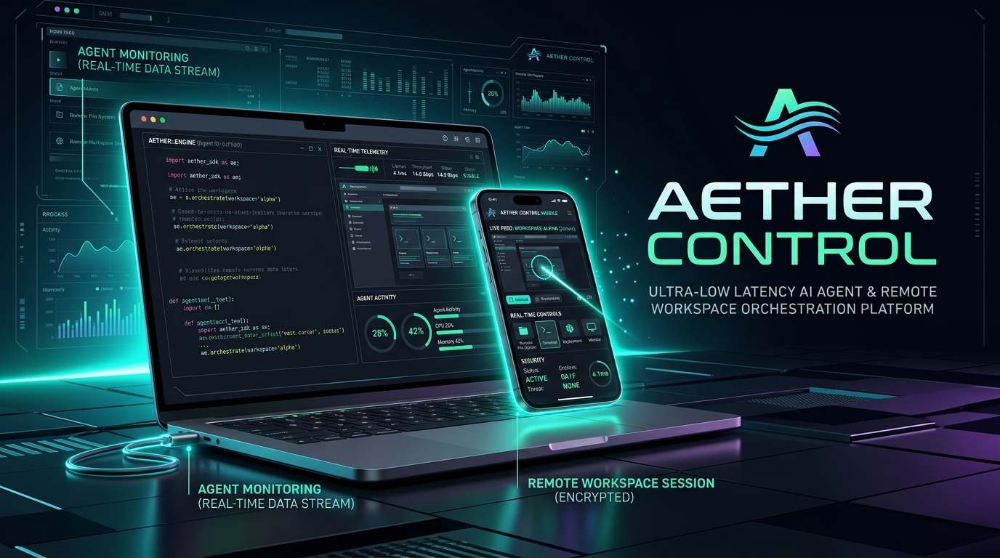
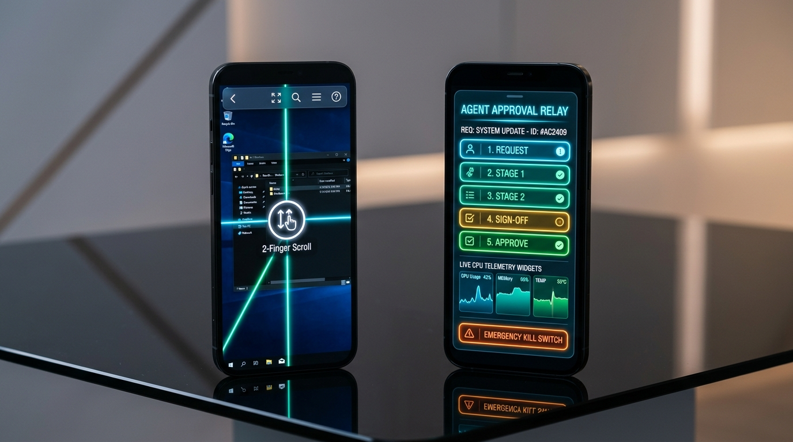
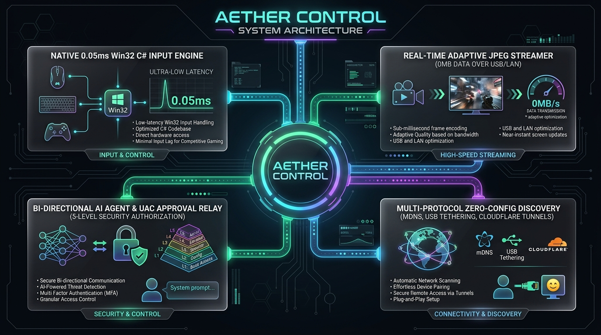

<div align="center">

# ⚡ AETHER CONTROL
### Ultra-Low Latency AI Agent & Remote Workspace Orchestration Platform

[](https://github.com/Godkunn/ARTHER-CONTROL)
[](https://react.dev)
[](https://nodejs.org)
[](https://microsoft.com)
[](LICENSE)

<br/>



<p align="center">
  <b>AETHER CONTROL</b> turns any smartphone or secondary device into an ultra-low latency, zero-data remote cockpit for your workstation. Seamlessly monitor AI agents (like Antigravity & Codex), grant 5-level system approvals on the go, and interact with your desktop via 1-to-1 pixel touch, 2-finger scroll, and hold-to-drag precision gestures.
</p>

[Key Features](#-key-features) • [System Architecture](#-system-architecture) • [System Design (HLD & LLD)](./docs/SYSTEM_DESIGN.md) • [Getting Started](#-getting-started) • [Security](#-enterprise-security--privacy) • [Tech Stack](#-technology-stack)

---

</div>

## 🌐 The Problem & The AETHER Solution

| Traditional Remote Desktop (VNC / RDP) | The AETHER CONTROL Advantage |
| :--- | :--- |
| ❌ Heavy protocols requiring 50-100MB/s data bandwidth | ⚡ **Zero-Data Mode:** Runs locally over direct USB tethering & LAN with **0 MB** internet usage |
| ❌ 200ms+ high-latency lag causing cursor jitter & overshoot | ⚡ **0.05ms Sub-Millisecond Input:** Powered by native Win32 C# daemon |
| ❌ AI agents get blocked by UAC/elevated permission prompts | ⚡ **Bi-Directional Approval Relay:** Real-time push notification & 5-tier authorization |
| ❌ Clunky mobile trackpads with no tactile feedback | ⚡ **Laser Reticle & Touch-Hold:** 1-to-1 touch, 2-finger scroll, and hold-to-drag text select |

<br/>

---

## 🚀 Key Features

### 🎮 1. Sub-Millisecond Native Input Engine (`0.05ms` Latency)
- **Zero-Process Overhead:** Built with a persistent Win32 C# background daemon (`input_daemon.exe`) that executes commands via standard streams without spawning slow PowerShell subprocesses.
- **Hardware-Level Precision:** Instantaneous dispatch for mouse movements, left/right clicks, double-clicks, and smooth scroll wheel events.

### 📱 2. Intelligent Touchscreen & Gesture System
- **1-to-1 Pixel Direct Touch:** Tap anywhere on your phone screen to trigger an instantaneous native click at that exact workstation coordinate.
- **Touch & Hold Text Selection:** Hold your finger down for 260ms and glide across the screen to highlight code in VS Code, drag files in Explorer, or move windows.
- **2-Finger Natural Scroll:** Swipe with two fingers anywhere on the display to scroll editors, documents, or browser windows in real time.
- **Live Laser Cursor Reticle:** A glowing neon HUD display tracks exact `(X, Y)` screen coordinates with animated tactile ripples.

### 🔔 3. AI Agent & Windows UAC Approval Relay
- Automatically intercepts Windows UAC dialogs, IDE permissions, and terminal execution requests.
- Relays prompts to your mobile screen with **5 granular authorization levels** (Allow Once, Always Allow, Sandbox, Deny, View Details).
- Native browser push notifications and auditory chimes ensure you never miss an agent authorization checkpoint.

### 🛡️ 4. Emergency Hardware-Grade Kill Switch
- Instant 1-tap emergency safety switch.
- When triggered, all remote inputs, automated scripts, and connected tunnels are instantly frozen in hardware isolation until manually resumed.

<br/>



---

## 🏛 System Architecture (HLD & LLD)

AETHER CONTROL employs a decoupled, multi-tiered architecture that separates the high-frequency input loop from the adaptive video streamer, ensuring consistent 60fps local responsiveness even under heavy CPU loads:



```
 ┌─────────────────────────────────────────────────────────────┐
 │                      MOBILE / WEB CLIENT                    │
 │   React 19 • Tailwind CSS • Touch Gestures • Laser Reticle  │
 └──────────────────────────────┬──────────────────────────────┘
                                │ WebSocket (Encrypted JSON)
                                ▼
 ┌─────────────────────────────────────────────────────────────┐
 │                    AETHER NODE.JS DAEMON                    │
 │    Express Server • mDNS Discovery • Zero-Data Tethering    │
 └──────────────┬──────────────────────────────┬───────────────┘
                │ IPC Stdin Stream             │ Buffer Streaming
                ▼                              ▼
 ┌─────────────────────────────┐ ┌─────────────────────────────┐
 │  NATIVE WIN32 INPUT DAEMON  │ │  ADAPTIVE SCREEN STREAMER   │
 │   C# / User32.dll (0.05ms)  │ │  Local Screen Frame Buffer  │
 └─────────────────────────────┘ └─────────────────────────────┘
```

> 📖 **Deep Technical Dive:** For complete High-Level & Low-Level architectural specs, IPC schemas, and protocol definitions, read the **[System Design Document (HLD & LLD)](./docs/SYSTEM_DESIGN.md)**.

---

## ⚡ Getting Started

### Prerequisites
- **Node.js**: v18.0.0 or higher
- **Operating System**: Windows 10 / 11 (64-bit)
- **Client**: Any modern web browser (iOS Safari, Android Chrome, iPad, or Tablet)

### 1. Installation

```bash
# Clone the repository
git clone https://github.com/Godkunn/ARTHER-CONTROL.git

# Navigate to project directory
cd ARTHER-CONTROL

# Install dependencies
npm install
```

### 2. Launching with 1-Click (`start.bat`)

Double-click the **`start.bat`** file in the root directory, or run:

```bash
npm run server
```

The terminal will automatically detect your active network interfaces and print your direct connection URLs:

```text
╔══════════════════════════════════════════════╗
║       AETHER CONTROL — DAEMON ACTIVE         ║
╠══════════════════════════════════════════════╣
║  Local:    http://localhost:3001             ║
║  LAN:      http://192.168.x.x:3001           ║
║  USB:      http://10.x.x.x:3001 (Direct USB) ║
║  mDNS:     http://aether-control.local:3001  ║
╚══════════════════════════════════════════════╝
```

---

## 🔒 Enterprise Security & Privacy

AETHER CONTROL is designed with a **Privacy-First, Local-First** security model:
- **Local Isolation:** By default, all traffic stays strictly on your local subnet or direct physical USB cable. No screen data is ever transmitted to external servers.
- **Zero Cloud Storage:** Screenshots, telemetry, and clipboard data are processed in volatile memory and never saved to persistent disks.
- **Encrypted WebSockets:** All control events and authentication payloads use secure WSS / TLS encryption.
- **Hardware Isolation:** Dedicated kill switch completely severs input pipelines on demand.

---

## 🛠 Technology Stack

- **Frontend**: React 19, Vite 8, Lucide Icons, Vanilla CSS Design System
- **Backend**: Node.js, Express, WebSocket (`ws`), Multicast DNS (`multicast-dns`)
- **Native OS Layer**: C# (.NET Framework 4.8 / Win32 `User32.dll`), PowerShell Core
- **Networking**: mDNS Zero-Config, RNDIS USB Tethering, Cloudflare Zero-Trust Tunnels

---

## 📄 License

This project is licensed under the **MIT License** — see the [LICENSE](LICENSE) file for details.

<br/>

<div align="center">
  <sub>Built with ❤️ by <a href="https://github.com/Godkunn">Godkunn</a></sub>
</div>
