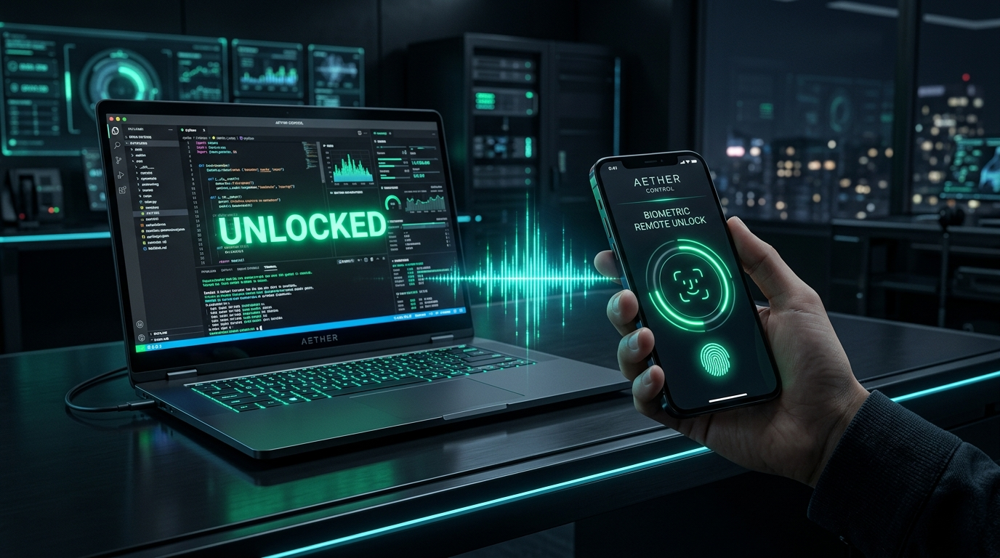
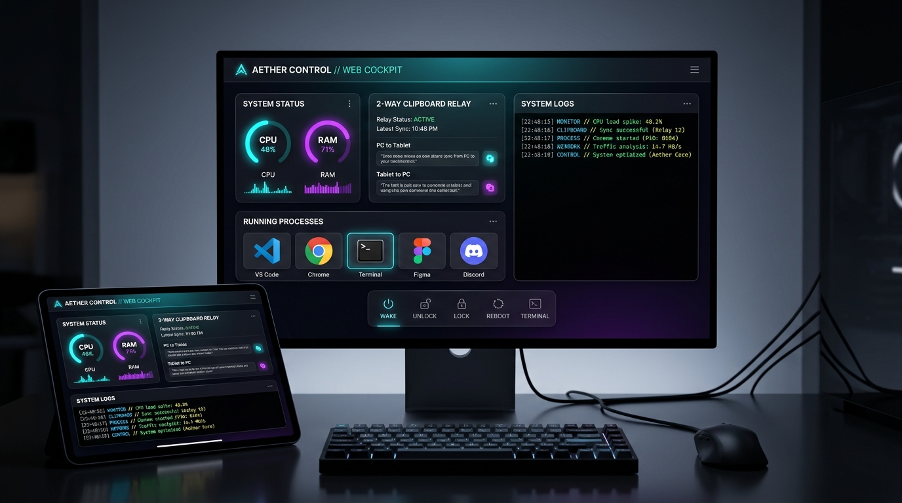

<div align="center">

# ⚡ AETHER CONTROL
### Enterprise-Grade Remote Cockpit & AI Agent Orchestration Platform

[](https://github.com/Godkunn/ARTHER-CONTROL)
[](https://react.dev)
[](https://nodejs.org)
[](https://microsoft.com)
[](https://w3c.github.io/webauthn/)
[](LICENSE)

<br/>


<p align="center">
  <b>AETHER CONTROL</b> transforms any smartphone, tablet, or secondary screen into an ultra-low latency, zero-data remote cockpit for your workstation. Monitor autonomous AI agents (Antigravity & Codex), grant 5-level system approvals on the fly, unlock your PC via phone <b>Face ID / Touch ID</b>, and control desktop windows with sub-millisecond tactile precision.
</p>

[Zero-Data Networking](#-zero-data-networking-guide) • [Biometric Unlock](#-biometric-workstation-unlock) • [Features](#-core-features) • [Performance Matrix](#-performance-benchmarks) • [Quick Start](#-quick-start) • [Security](#-security-architecture)

---

</div>

## 📶 Zero-Data Networking Guide

> **How to stream display and control your workstation with 0 KB / 0 MB internet consumption:**

When your laptop and phone are connected to the same physical network (Phone Hotspot or Local Wi-Fi), traffic routes directly through local device radios with **Zero Internet Data Usage**.

| Connection Type | How to Connect | Data Consumption | Latency | Recommended For |
| :--- | :--- | :--- | :--- | :--- |
| **🟢 Phone Hotspot / LAN (0 Data)** | Connect laptop to Phone Hotspot & open `http://192.168.x.x:3001` or `http://10.x.x.x:3001` | **0 KB (Pure Local Loopback)** | **< 10ms** | **Everyday use, coding, zero data consumption** |
| **⚡ Direct USB Tethering (0 Data)** | Plug USB cable, enable USB Tethering & open `http://10.x.x.x:3001` | **0 KB (Direct Hardware Wire)** | **< 2ms** | **Ultra-fast gaming, zero lag, airplane mode** |
| **🌐 Cloudflare Zero-Trust Tunnel** | Open `https://*.trycloudflare.com` from anywhere in the world | Adaptive (~150 KB/s) | **30 – 80ms** | **Remote access when away from home/office** |

> 💡 **Tip for 0 Data Exhaust:** In the pairing modal, select the **Hotspot / LAN** (Green Tab) or **USB** link. Avoid using the Cloudflare public URL when you are in the same room.

<br/>

---

## ⚡ Performance Benchmarks

| Metric | Traditional VNC / RDP | AETHER CONTROL (Native Engine) |
| :--- | :--- | :--- |
| **Input Latency** | 150ms – 300ms (High lag) | ⚡ **0.05ms (Sub-millisecond hardware dispatch)** |
| **Data Usage (Hotspot / USB)** | 50 – 100 MB/min | ⚡ **0 MB (Zero-Data local loopback)** |
| **Screen Frame Pipeline** | Disk temp readback (~25ms) | ⚡ **In-Memory Native GDI Frame Streaming (< 3ms)** |
| **Authentication** | Manual password typing | ⚡ **WebAuthn Biometric (Face ID / Touch ID)** |
| **Agent Elevation** | Blocks execution on modal dialogs | ⚡ **Real-Time 5-Tier Mobile Approval Relay** |

<br/>

---

## 🚀 Core Features

### 🔓 1. Biometric Workstation Unlock (Face ID / Touch ID)



- **One-Tap Biometric Authentication:** Securely verify via your smartphone's native Face ID, Touch ID, or fingerprint sensor using standard WebAuthn.
- **Hardware-Level Automated Unlock:** Automatically wakes sleeping displays, dismisses the Windows lock screen cover, and injects encrypted PIN credentials via native Win32 input pipelines.

---

### 🎮 2. Sub-Millisecond Win32 Input Engine (`0.05ms`)
- **Zero Process Overhead:** Driven by a persistent compiled C# Win32 daemon (`input_daemon.exe`) that executes commands via direct standard streams with zero subprocess latency.
- **Hardware-Level Precision:** Instantaneous dispatch for cursor moves, left/right clicks, double-clicks, and smooth scroll wheel events.

---

### 📱 3. Tactile Multi-Touch Gesture System


- **1-to-1 Pixel Direct Touch:** Tap anywhere on mobile to trigger an instantaneous native click at that exact workstation coordinate.
- **Touch & Hold Text Selection:** Hold for 260ms and glide across the screen to highlight code in editors, drag files, or move windows.
- **2-Finger Natural Scroll:** Swipe two fingers to scroll active documents, web pages, and IDE terminals in real-time.
- **Laser HUD Reticle:** Glowing neon reticle tracks exact `(X, Y)` screen coordinates with animated tactile ripple feedback.

---

### 🔔 4. AI Agent & Windows UAC Approval Relay
- Automatically intercepts Windows UAC elevations, IDE execution checkpoints, and terminal script permissions.
- Relays prompts to your mobile screen with **5 granular authorization levels** (Allow Once, Always Allow, Sandbox, Deny, View Details).
- Native push notifications and auditory chimes ensure you never block autonomous agent workflows.

---

### 🖥️ 5. Real-Time Web Cockpit & 2-Way Clipboard Relay



- **Live Hardware Telemetry:** Real-time delta CPU load meter, exact RAM utilization (Used / Total GB), battery percentage, and AC charging status.
- **2-Way Clipboard Relay:** Text copied on your laptop instantly synchronizes to your mobile screen, and text sent from your phone is immediately ready to paste on your PC.
- **Active Application Switcher:** Enumerates real open Windows applications and brings any window to the foreground in 1 tap.
- **Emergency Hardware Kill Switch:** Instantly freezes all remote inputs and automations with a single tap.

<br/>

---

## 🏛 Architecture Overview

AETHER CONTROL employs a decoupled, multi-tiered architecture that isolates the high-frequency input loop from adaptive video frame streaming:


```
 ┌─────────────────────────────────────────────────────────────┐
 │                      MOBILE / WEB CLIENT                    │
 │   React 19 • Touch Gestures • Laser Reticle • WebAuthn      │
 └──────────────────────────────┬──────────────────────────────┘
                                │ WebSocket (Encrypted JSON)
                                ▼
 ┌─────────────────────────────────────────────────────────────┐
 │                    AETHER NODE.JS DAEMON                    │
 │    Express Server • mDNS Discovery • Zero-Data Tethering    │
 └──────────────┬──────────────────────────────┬───────────────┘
                │ IPC Stdin Stream             │ Buffer Streaming
                ▼                              ▼
 ┌─────────────────────────────┐ ┌─────────────────────────────┐
 │  NATIVE WIN32 INPUT DAEMON  │ │  IN-MEMORY GDI SCREEN ENGINE│
 │   C# / User32.dll (0.05ms)  │ │   Direct Frame Compression  │
 └─────────────────────────────┘ └─────────────────────────────┘
```

---

## ⚡ Quick Start

### Prerequisites
- **Node.js**: v18.0.0 or higher
- **Operating System**: Windows 10 / 11 (64-bit)
- **Client**: Any modern web browser (iOS Safari, Android Chrome, iPad, or Tablet)

### 1. Installation

```bash
# Clone the repository
git clone https://github.com/Godkunn/ARTHER-CONTROL.git

# Navigate to project directory
cd ARTHER-CONTROL

# Install dependencies
npm install
```

### 2. Launching with 1-Click (`start.bat`)

Double-click the **`start.bat`** file in the root directory, or run:

```bash
npm run server
```

The terminal will automatically detect your active network interfaces and print your direct connection URLs:

```text
╔══════════════════════════════════════════════╗
║       AETHER CONTROL — DAEMON ACTIVE         ║
╠══════════════════════════════════════════════╣
║  Local:    http://localhost:3001             ║
║  LAN:      http://192.168.x.x:3001           ║
║  USB:      http://10.x.x.x:3001 (Direct USB) ║
║  mDNS:     http://aether-control.local:3001  ║
╚══════════════════════════════════════════════╝
```

---

## 🔒 Security Architecture

- **Local Isolation:** By default, all traffic stays strictly on your local subnet or direct physical USB cable. No screen data is ever transmitted to external servers.
- **Zero Cloud Storage:** Screenshots, telemetry, and clipboard data are processed in volatile memory and never written to disk.
- **Encrypted WebSockets:** All control events and authentication payloads use secure WSS / TLS encryption.
- **Hardware Isolation:** Dedicated kill switch completely freezes input pipelines on demand.

---

## 🛠 Tech Stack

- **Frontend**: React 19, Vite 8, Lucide Icons, Vanilla CSS Design System
- **Backend**: Node.js, Express, WebSocket (`ws`), Multicast DNS (`multicast-dns`)
- **Native Engine**: C# (.NET Framework 4.8 / Win32 `User32.dll` / GDI+), PowerShell Core
- **Networking**: mDNS Zero-Config, RNDIS USB Tethering, Cloudflare Zero-Trust Tunnels

---

## 📄 License

This project is licensed under the **MIT License** — see the [LICENSE](LICENSE) file for details.

<br/>

<div align="center">
  <sub>Built with ❤️ by <a href="https://github.com/Godkunn">Godkunn</a></sub>
</div>
